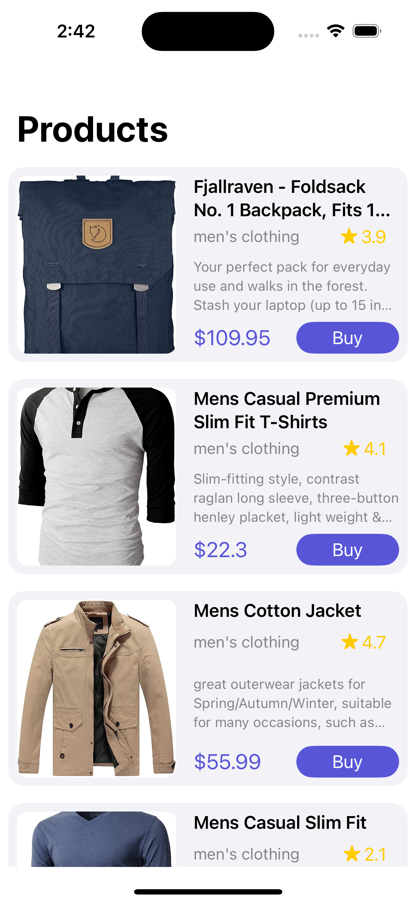
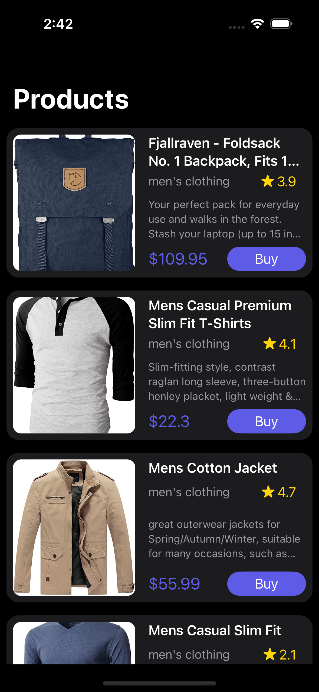

# MVVM (Model View ViewModel) + Data Binding + Singleton + Generic API Calls + SOLID Principle

In this video we learn about the Model View ViewModel (MVVM) Design Pattern.
We start by understanding how each component connects with themselves, then we implement an example project (Products API) using the MVVM pattern.
We also learn how to bind our View with our ViewModel using the Closure(Data Binding) method.

Products Light Mode    |  Products Dark Mode
:-------------------------:|:-------------------------:
|

## Characteristics

- [x] UIKit
- [x] MVVM architecture
- [x] Data Binding
- [x] Singleton Design Pattern
- [x] URLSession - Generic Api calls - Networking API
- [x] Decodable Protocol with JSONDecoder
- [x] Downloading Image - Kingfisher Library
- [x] Swift Package Manager - SPM
- [x] Closure, Completion, Typealias, Enum
- [x] Detailed use of UIStackView, UITableView, UITableViewCell XIB
- [x] Inheritance - Final Keyword, Init()
- [x] Memory Management
- [x] Light and Dark Mode

## Resources
- Youtube Video: https://www.youtube.com/@abhisekprusty4990

## Say Hi on Social Media:
- Linkedin: www.linkedin.com/in/abhisek-prusty-23876b191

# My Designation : iOS Developer

- My GitHub Account : https://github.com/abhisekprusty977

- Youtube Channel : https://www.youtube.com/@abhisekprusty4990

- SwiftUI Playlist - https://www.youtube.com/playlist?list=PLuP_IsbpuSAlGnB6pRFySgkzitsnR00Y0

- UIKit With Storyboard - https://www.youtube.com/playlist?list=PLuP_IsbpuSAkiwJS_An90f4qnPmRxz7D6

- Travel Playlist - https://www.youtube.com/playlist?list=PLuP_IsbpuSAlOdkSEHe7176JtOWeyz31a

#My Applications:

- Apple Pay : https://github.com/abhisekprusty977/Apple-Pay

- Food App : https://github.com/abhisekprusty977/FoodApp-SwiftUI

- Building An App With Liquid Glass : https://github.com/abhisekprusty977/Building-an-app-with-Liquid-Glass

- Adding Intelligent App Features With Generative Models : https://github.com/abhisekprusty977/Adding-intelligent-app-features-with-generative-models

- Adopting App Intents To Support System Experiences : https://github.com/abhisekprusty977/Adopting-App-Intents-to-support-system-experiences

- Adopting SwiftData for a Core Data app : https://github.com/abhisekprusty977/Adopting-SwiftData-for-a-Core-Data-app

- Understanding StoreKit WorkFlows : https://github.com/abhisekprusty977/StoreKit-workflows

- Real Time Chat Application : https://github.com/abhisekprusty977/Real-Time-Chat-Application

# Project Documentation Link :
- Apple Pay Project Documentation : https://docs.google.com/document/d/1r0r4iO0tXC3VUlNJztKiIq01wLfRSJoP94YpRskXjfs/edit?usp=sharing 

- Food App Project Documentation : https://docs.google.com/document/d/1SvcKUT84Mv1fBaXXgPwaAaWo_o1pczVS76MN-K8ScZY/edit?usp=sharing 

- SwiftUI LiquidGlass Project Documentation : https://docs.google.com/document/d/1LkzketQoOJKPxHPbsskB46dB8sUEOwKEzNnbRQK1sCc/edit?usp=sharing 

- Adding Intelligent App Features With Generative Models Project Documentation : https://docs.google.com/document/d/1aVkbyej1zpfgCDJfmp-1lIPjexUJptkxiiuCMqZqm2c/edit?usp=sharing 

- Adopting App Intents To Support System Experiences Project Documentation : https://docs.google.com/document/d/1Te8B_m-ypjYt8KAhPrn5SpagggpdmxMxgQ45DSDDZVc/edit?usp=sharing 

- Adopting SwiftData For A Core Data App Project Documentation : https://docs.google.com/document/d/1EtKC1tBnjNOtQoaGSVBVrWTXGGYH_4bh0w__ayzYlhU/edit?usp=sharing

- Understanding StoreKit WorkFlows for Project Documentation : https://docs.google.com/document/d/1viXaDNEpJjJE93JyYhi6faQ-nqmVgI-1YixxK7NldhQ/edit?usp=sharing

# My Projects Youtube Links :
- Apple Pay : https://youtu.be/PXAGodERtCU?si=2UNQOUFrkZjZZMi1

- Food App : https://youtu.be/eWnWKeUDFRU?si=8oZtqvOwjRRsEIOB

- SwiftUI LiquidGlass : https://youtu.be/OjAGw_74xYM?si=XO8FZShgu9-Enxwq

- Adding Intelligent App Features With Generative Models : https://www.youtube.com/watch?v=Wc5XUw1S7Kg

- Adopting App Intents To Support System Experiences : https://youtu.be/_4k3RiHtOr0?si=E0TWnU3NFjX8QAJm

- Adopting SwiftData For A Core Data App : https://youtu.be/dE4HmNowYk0

- Understanding StoreKit WorkFlows : https://www.youtube.com/watch?v=jGyQN0jWg20

- Understanding MVC | MVVM | VIPER | Clean Architecture : https://www.youtube.com/watch?v=xIWHujzNzLM

- Real Time Chat Application : https://www.youtube.com/watch?v=ejeq1pLHh_8

### YOUTUBE:
If you enjoyed this project and found it useful, please share and recommend it so others can find it 💚💚💚💚💚💚 !!!!
https://www.youtube.com/@abhisekprusty4990 - Please Like, Subscribe and share if it found useful for you 🤟

### Enjoy!!! 😀
